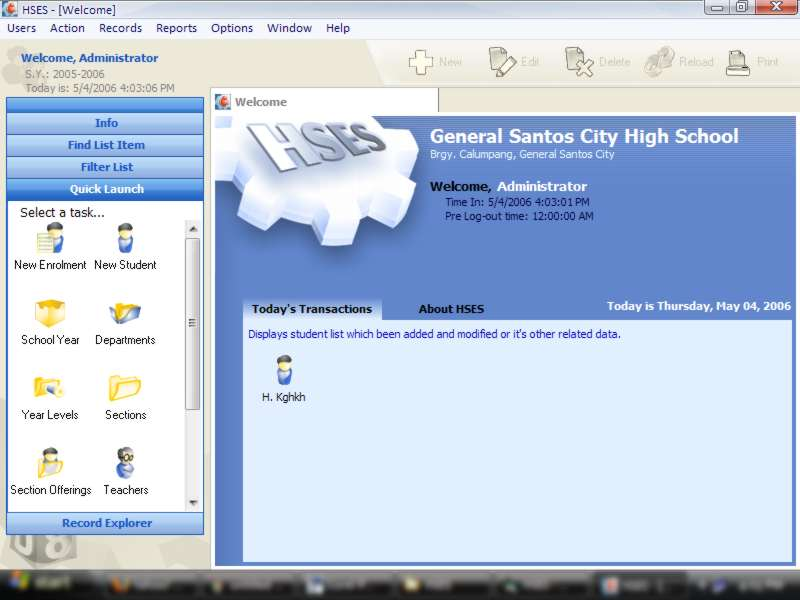



## bob8works\(Vincent J\. Jamero\): HSES \- High School Enrolment System \(key: Enrollment Registration\)

### Description

(Updated with new improved UI)

HSES - High School Enrolment System for Curriculumn based public high school institutions. It includes Student Registration, Students and Teachers Scheduling,Student's Grades Management.

E-Mail me at bob8works@yahoo.com form some questions or inquiries. Thanks!
 
### More Info
 

             |
---                |---
**Submitted On**   |2006-06-27 16:03:46
**By**             |[bob8works](https://github.com/Planet-Source-Code/PSCIndex/blob/master/ByAuthor/bob8works.md)
**Level**          |Intermediate
**User Rating**    |4.8 (575 globes from 119 users)
**Compatibility**  |VB 6\.0, VBA MS Access
**Category**       |[Complete Applications](https://github.com/Planet-Source-Code/PSCIndex/blob/master/ByCategory/complete-applications__1-27.md)
**World**          |[Visual Basic](https://github.com/Planet-Source-Code/PSCIndex/blob/master/ByWorld/visual-basic.md)
**Archive File**   |[b8w\_HSES\_\-2056773292007\.zip](https://github.com/Planet-Source-Code/bob8works-bob8works-vincent-j-jamero-hses-high-school-enrolment-system-key-enrollment-regi__1-65061/archive/master.zip)

